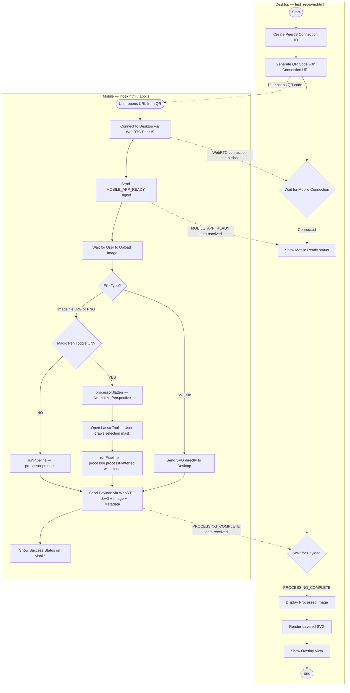
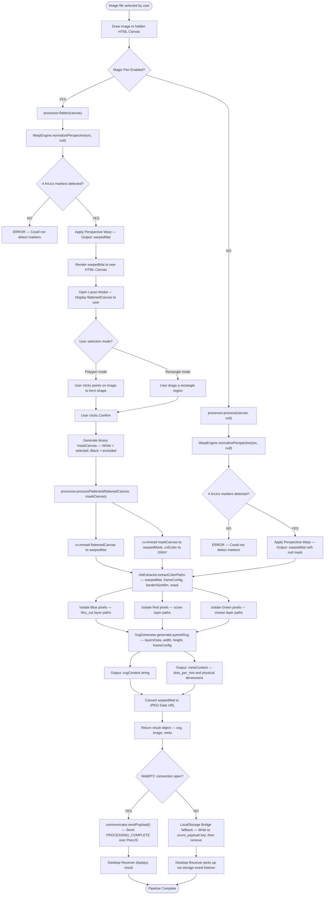

# Urumi Vision App — Flowcharts

To view or export these diagrams, paste each code block into https://mermaid.live

---

## 1. High-Level Diagram

Shows the overall system flow across the Desktop Receiver and Mobile App.

---

## 2. Low-Level Diagram

Shows the internal data flow inside the image processing pipeline.

