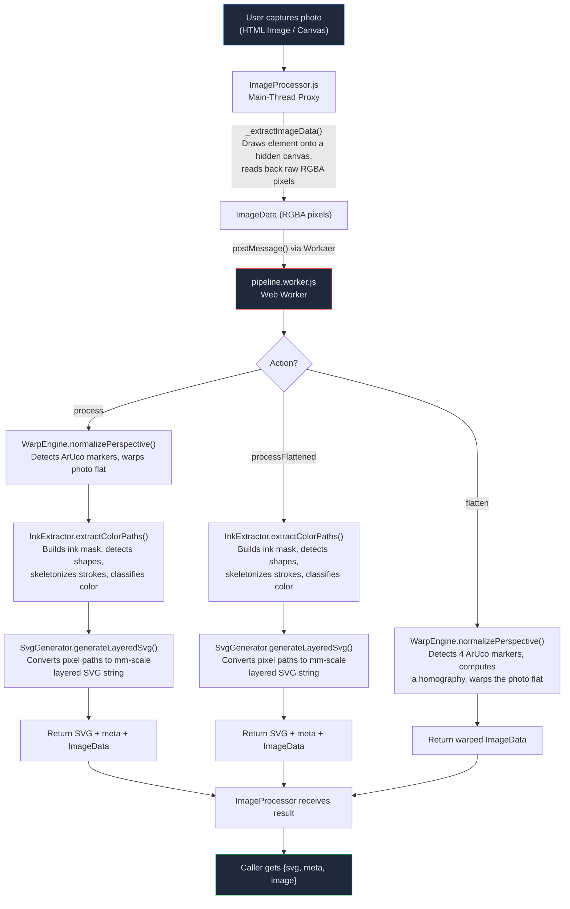
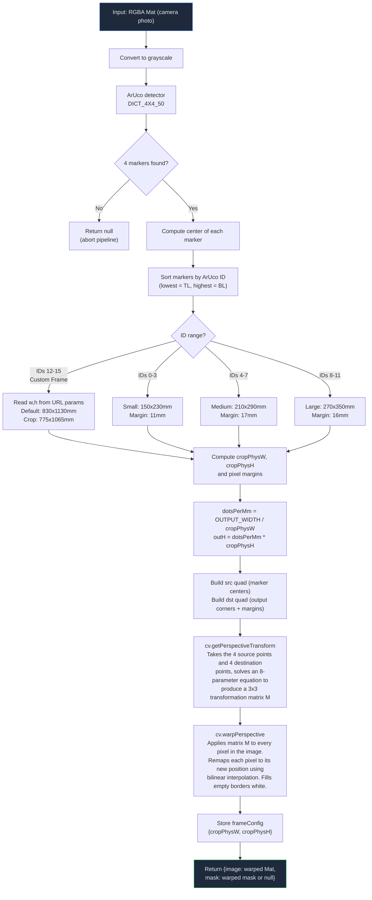
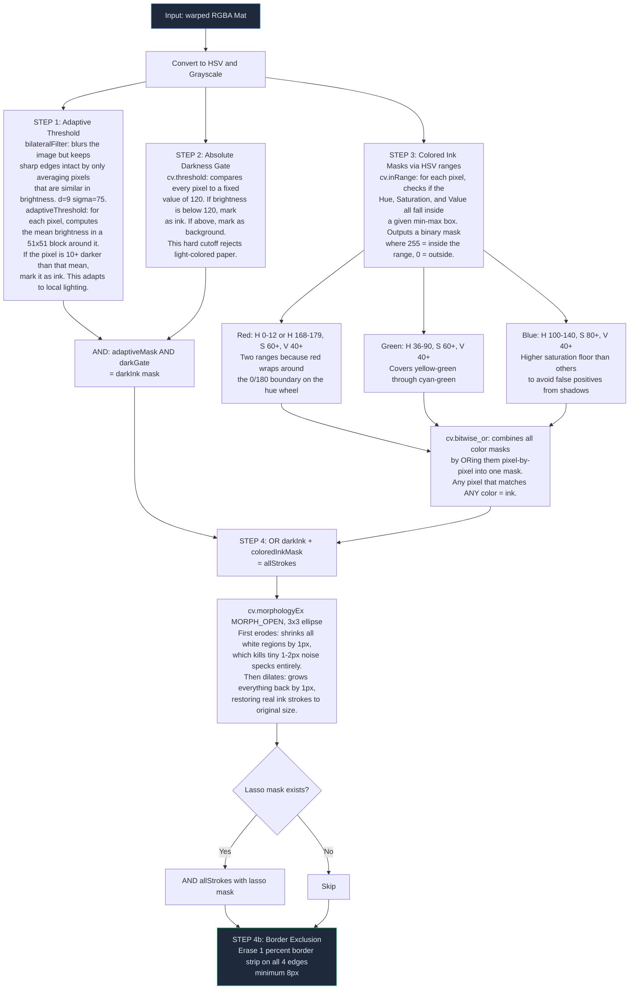
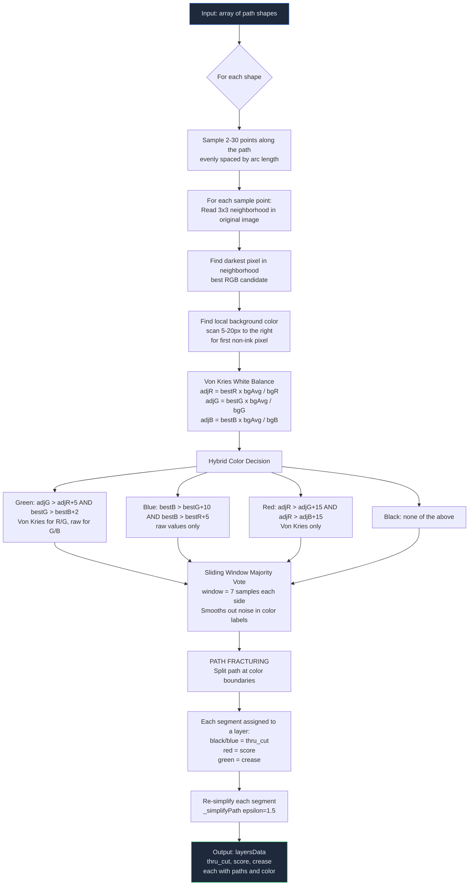
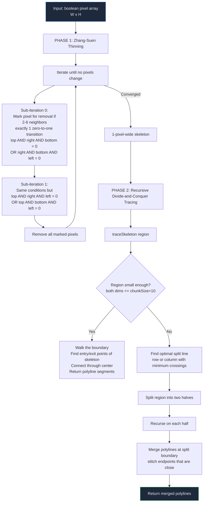
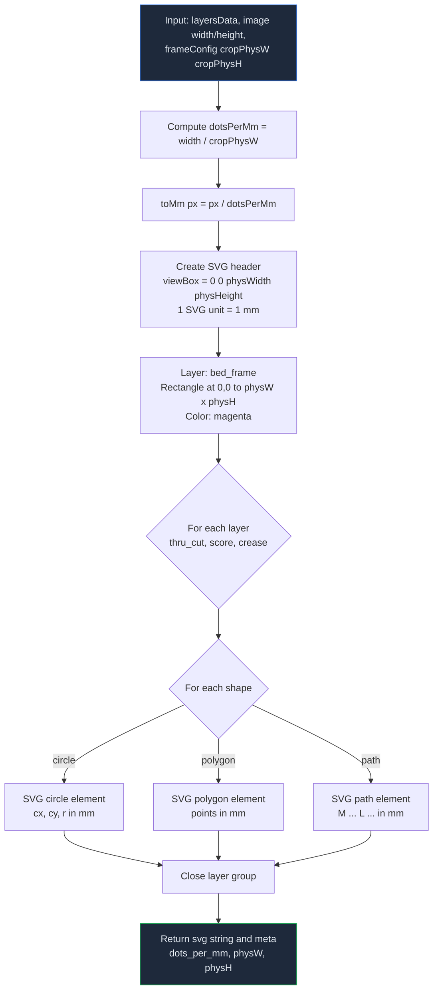

# SVG Skeletonization — Algorithm Flowchart

This document shows the algorithms and data flow inside `svg-skeletonization/src`.

---

## File Inventory

| File | Role | Lines |
|---|---|---|
| `index.js` | Public entry point — re-exports all modules | 6 |
| `ImageProcessor.js` | Main-thread proxy. Sends `ImageData` to the Worker, returns SVG + image. | 130 |
| `pipeline.worker.js` | Web Worker. Loads OpenCV, runs the three core engines in sequence. | 159 |
| `WarpEngine.js` | ArUco marker detection + perspective warp to a flat, scaled canvas. | 156 |
| `InkExtractor.js` | Ink mask extraction, geometric shape detection, skeletonization, color classification, and path fracturing. | 467 |
| `trace_skeleton.js` | Minified TraceSkeleton library: Zhang-Suen thinning + recursive divide-and-conquer polyline tracing. | 4 (minified) |
| `SvgGenerator.js` | Converts pixel-coordinate paths into a layered SVG with mm-scale coordinates. | 62 |

---

## 1. High-Level Pipeline

This chart shows the complete data flow from a camera image to the final SVG string.

> **Important:** The `process` action runs the full pipeline (warp + extract + SVG). The `flatten` action runs only the warp step. The `processFlattened` action skips the warp and runs extract + SVG on a pre-warped image.

---

## 2. WarpEngine — Perspective Normalization

**Purpose:** Detect 4 ArUco markers in the photo. Apply a perspective transform to produce a flat, axis-aligned image at a known physical scale.

### Key Algorithm Details

| Concept | Method |
|---|---|
| **Marker detection** | OpenCV `aruco_ArucoDetector` with `DICT_4X4_50` dictionary |
| **Corner assignment** | Sort detected IDs numerically — the frame generator always assigns IDs clockwise from top-left |
| **Perspective transform** | 4-point homography via `getPerspectiveTransform` then `warpPerspective` |
| **Output scale** | Fixed width of 2000 px. Height is calculated to maintain the physical aspect ratio. |
| **Mask warping** | If a lasso mask exists, it is warped with `INTER_NEAREST` to maintain sharp binary edges |

---

## 3. InkExtractor — Core Extraction Pipeline

This is the largest and most complex module. It has two major stages:

1. **Mask Generation** — find all ink pixels in the warped image.
2. **Path Extraction + Color Classification** — convert the mask into classified vector paths.

### 3A. Ink Mask Generation (Steps 1-4)

> **Note:** The dual-gate approach (adaptive threshold AND absolute darkness) prevents the system from detecting paper texture as ink. The separate colored-ink HSV masks catch faint pen strokes that do not pass the darkness gate.

### 3B. Mask-to-Paths Conversion — `_processMaskToPaths`

```mermaid
flowchart TD
    P1["Input: allStrokes binary mask"] --> P2["cv.morphologyEx MORPH_CLOSE 3x3 rect<br/>First dilates then erodes. This fills small<br/>1-2px gaps inside ink strokes without<br/>changing the overall stroke size."]
    P2 --> P3["cv.connectedComponentsWithStats<br/>Flood-fills the mask to find isolated blobs.<br/>Assigns a unique numeric label to each blob.<br/>Also computes area, bounding box width,<br/>bounding box height for every blob."]
    P3 --> P4["Filter blobs:<br/>Keep if area >= 0.005 percent of image<br/>OR max span >= 1 percent of min dimension.<br/>Removes tiny dust specks while keeping<br/>thin but long ink strokes."]
    P4 --> P5["cv.morphologyEx MORPH_CLOSE 3x3 rect<br/>Second close pass on the filtered mask<br/>to reconnect any strokes that lost pixels<br/>during the blob-filtering step."]
    
    P5 --> P6["GEOMETRIC SHAPE DETECTION"]
    P6 --> P6a["Heavy MORPH_CLOSE 15x15 ellipse<br/>Very aggressive close that merges nearby<br/>ink regions. Bridges gaps in hand-drawn<br/>circles and triangles so they look solid."]
    P6a --> P6b["cv.findContours RETR_EXTERNAL<br/>Walks the border of each white region<br/>and records the boundary as an ordered<br/>list of x,y points. RETR_EXTERNAL means<br/>only outermost boundaries, no holes."]
    P6b --> P6c{"For each contour"}
    
    P6c --> P6d["cv.convexHull: wraps a rubber band<br/>around all contour points to get the<br/>smallest convex shape that contains them.<br/>solidity = contour area / hull area.<br/>High solidity = compact convex shape."]
    P6d --> P6e{"solidity > 0.75?"}
    P6e -->|"No"| P6f["Leave for skeletonization"]
    P6e -->|"Yes"| P6g["cv.approxPolyDP: walks along the contour<br/>and drops points that deviate less than<br/>5 percent of the perimeter from a straight<br/>line. Reduces a wobbly hand-drawn shape<br/>to its essential vertices."]
    P6g --> P6h{"circularity > 0.75?<br/>circularity = 4 * pi * area / perimeter^2.<br/>A perfect circle = 1.0, a square = 0.78."}
    P6h -->|"Yes"| P6i["cv.minEnclosingCircle: finds the<br/>smallest circle that fully contains<br/>all contour points. Returns center and radius."]
    P6h -->|"No"| P6j{"3-8 vertices?"}
    P6j -->|"Yes"| P6k["Snap to polygon: take the vertices<br/>from approxPolyDP and connect them<br/>as straight line segments."]
    P6j -->|"No"| P6f
    
    P6i --> P6l["Erase blob from finalMask<br/>filled or thick brush"]
    P6k --> P6l
    
    P6l --> P7["SKELETONIZATION"]
    P6f --> P7
    P7 --> P7a["_vectorizeAndSkeletonize<br/>Converts OpenCV mask to a flat bool array,<br/>then calls TraceSkeleton"]
    P7a --> P7b["Convert mask to bool array<br/>Each pixel becomes 1 for ink or 0 for empty"]
    P7b --> P7c["TraceSkeleton.fromBoolArray<br/>Runs Zhang-Suen thinning to get a<br/>1px skeleton, then traces it into polylines"]
    P7c --> P7d["Returns raw polylines"]
    
    P7d --> P8["POST-PROCESSING"]
    P8 --> P8a["Filter oversized paths<br/>more than 45 percent of image dimension"]
    P8a --> P8b["Filter hair-thin elongated noise<br/>aspect ratio more than 12:1 and long"]
    P8b --> P8c{"Path diagonal less than 80px?"}
    P8c -->|"Yes"| P8d["_smoothPath: weighted moving-average<br/>on each interior point, 2 iterations<br/>then _simplifyPath: Douglas-Peucker<br/>removes redundant points, epsilon=1.5"]
    P8c -->|"No"| P8e["_simplifyPath: Douglas-Peucker only<br/>epsilon=3.0, no moving-average<br/>Keeps sharp corners like arrowheads"]
    
    P8d --> P9["Merge: perfectShapes + smoothedPaths"]
    P8e --> P9

    style P1 fill:#1e293b,color:#e2e8f0,stroke:#3b82f6
    style P9 fill:#1e293b,color:#e2e8f0,stroke:#22c55e
```

### 3C. Color Classification + Path Fracturing (Steps 5-6)

> **Important — Why the hybrid color approach?** Cardboard has a strong red bias (R=180, G=140, B=100). Von Kries white balance removes this bias and correctly separates green ink from the red background. However, the low blue of cardboard causes the Von Kries blue multiplier to inflate camera noise. Therefore, blue detection uses raw RGB values to prevent false positives.

---

## 4. TraceSkeleton — Thinning and Tracing

This is the minified `trace_skeleton.js`. The algorithm has two phases:

### Zhang-Suen Thinning — Conditions Summary

| Check | Purpose |
|---|---|
| **2 to 6 neighbors** | Keep endpoints (1 neighbor) and prevent erosion of thick regions |
| **Exactly 1 transition (0 to 1)** | Preserve connectivity — only thin at edges, not at junctions |
| **Product checks** | Make sure the pixel is on the correct side of the stroke. Alternates between sub-iterations to prevent directional bias. |

---

## 5. SvgGenerator — Pixel-to-MM SVG Output

> **Note:** The SVG uses **top-left origin** with Y increasing downward — same as the warped image. Any Y-axis flip for G-code or CNC machines must occur in a separate post-processor, not here.

---

## 6. Utility Algorithms

### Douglas-Peucker Path Simplification — `_simplifyPath`

- **Input:** A polyline (ordered list of x,y points) and an epsilon tolerance value.
- **How it works:**
  1. Draw a straight line from the first point to the last point of the polyline.
  2. For every point between them, measure the perpendicular distance from that point to the line. This measurement is done by `_perpendicularDistance`, which uses the standard point-to-line-distance formula.
  3. Find the point with the maximum distance (`dmax`).
  4. If `dmax` is larger than epsilon, the curve bends too much to be a straight line. Split the polyline at that point and recursively simplify each half.
  5. If `dmax` is smaller than epsilon, the curve is close enough to straight. Replace all intermediate points with a single straight line.
- **Effect:** Reduces point count while it preserves shape fidelity within the epsilon tolerance. A larger epsilon produces fewer points but loses fine detail.

### Perpendicular Distance — `_perpendicularDistance`

- **Input:** A point and a line defined by two endpoints.
- **How it works:** Calculates the shortest distance from the point to the infinite line through the two endpoints. Uses the formula: `|((y2-y1)*x0 - (x2-x1)*y0 + x2*y1 - y2*x1)| / sqrt((y2-y1)^2 + (x2-x1)^2)`. If the two endpoints are the same, it returns the straight-line distance between them.
- **Usage:** Called only by `_simplifyPath` to decide which points to keep and which to discard.

### Moving-Average Smoothing — `_smoothPath`

- **Input:** A polyline and an iteration count.
- **How it works:**
  1. Walk through every interior point (skip the first and last).
  2. Replace each interior point with a weighted average of itself and its two neighbors: `new_x = 0.25 * prev_x + 0.50 * current_x + 0.25 * next_x`. Same for y.
  3. The first and last points never change, so the path endpoints stay fixed.
  4. Repeat the entire pass for N iterations. More iterations = smoother curve.
- **Usage:** Applied only to small paths (diagonal less than 80px) to reduce jitter. Large paths skip this to preserve sharp corners such as arrowheads.

---

## 7. Complete End-to-End Data Transform

